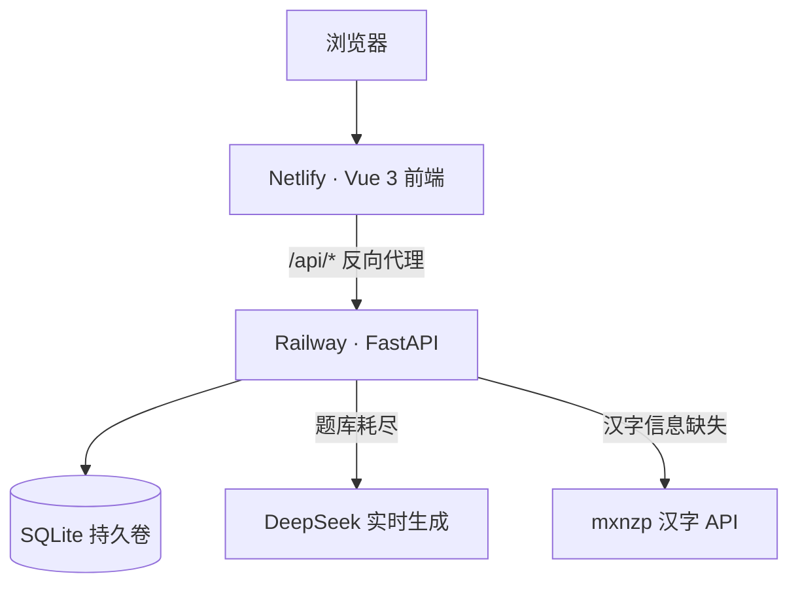

# 字谜挑战 · Word Riddle Game

面向小学生的汉字字谜教育游戏：猜字谜学汉字，AI 智能出题 + 社区共创字谜。

🌐 **在线体验**：[wordriddles.netlify.app](https://wordriddles.netlify.app)

---

## 技术栈

**Vue 3 + Vite + Pinia** · **FastAPI + SQLAlchemy** · **SQLite** · **DeepSeek LLM** · **Netlify + Railway**

---

## 系统架构



---

## 核心亮点

- **题库优先 + AI 兜底**：131 条经典字谜加权随机出题；题库做完自动调 LLM 生成新题并入库，越玩越多
- **加权选题算法**：按答案字分组，结合赞踩评分与质量权重随机抽取，优质题曝光更高
- **社区共创闭环**：用户上传 → 管理员审核 → 赞踩评价 → 差评自动标记降权，形成内容质量治理链路
- **三级渐进提示**：结构拆解 → 部首 → 拼音释义，提示越多扣分越多，兼顾引导与挑战
- **汉字知识图谱**：2467 个统编版生字的拼音/部首/笔画/结构/释义，爬虫 + 本地库 + 在线 API 三级缓存

---

## 功能截图

| 首页 | 游戏页 |
|---|---|
|  |  |
| **上传字谜** | **管理后台** |
|  |  |

---

## 快速开始

```bash
# 一键启动（Windows）
start.bat

# 或手动
cd backend && uvicorn main:app --reload --port 8000
cd fronted && npm run dev
```

后端启动时自动建表并填充种子数据，无需手动初始化。

---

## 项目结构

```
backend/   FastAPI 后端（出题 / 评价 / 审核 / AI 生成 / 汉字爬虫）
fronted/   Vue 3 前端（游戏 / 上传 / 管理后台）
docs/      截图与文档
```
