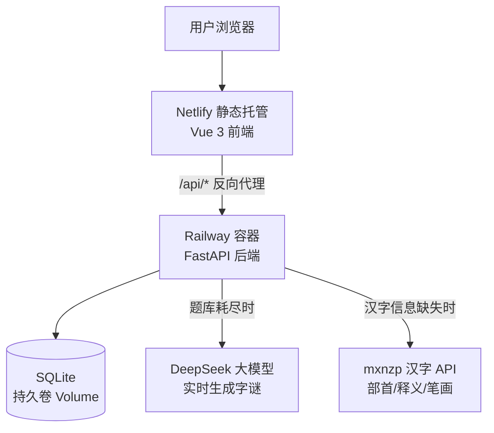
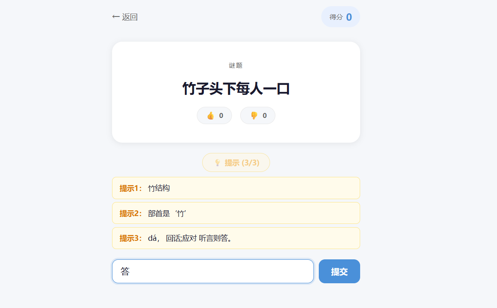
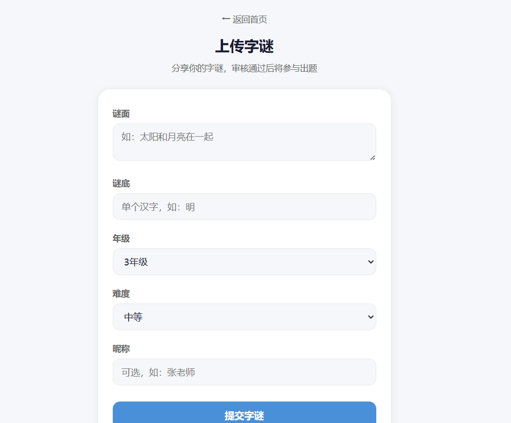
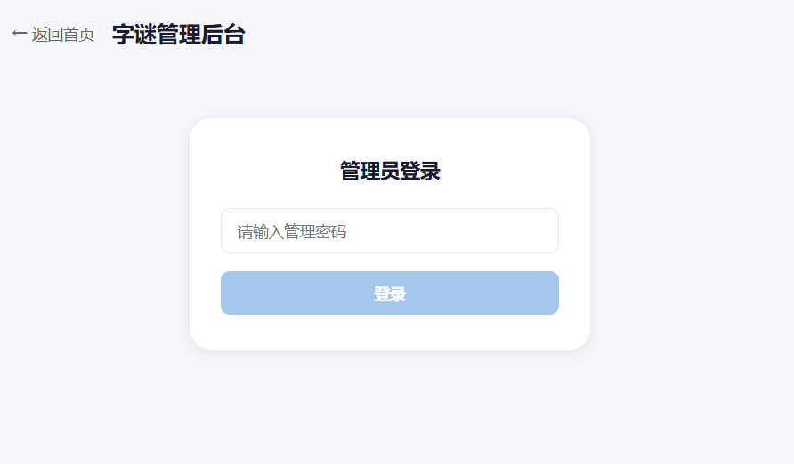

# 字谜挑战 · Word Riddle Game

> 面向小学生的汉字字谜教育游戏。通过猜字谜学习汉字的结构、部首与含义，支持 AI 智能出题、三级提示、用户共创字谜与社区评价。

🌐 **在线体验**：[https://wordriddles.netlify.app](https://wordriddles.netlify.app)

---

## ✨ 功能特性

### 核心玩法
- **题库优先 + AI 兜底**：优先从 131 条经典字谜题库出题，题库做完后调用大模型实时生成新题
- **加权随机出题**：按答案字分组，结合赞踩评分与质量权重随机选题，好题曝光更多
- **不重复出题**：基于 LocalStorage 记录已做题目，同一选择组合下不会重复
- **三级渐进提示**：结构拆解 → 部首提示 → 拼音+释义，提示越多扣分越多
- **答后汉字详情**：答完展示该字的拼音、部首、笔画、结构、释义

### 社区共创
- **用户上传字谜**：任何人可提交自创字谜，进入待审核队列
- **赞 / 踩评价**：对每道题投票，踩过的题不再出给本人
- **管理员审核**：密码保护的管理后台，支持通过 / 拒绝 / 降权 / 下架
- **差评自动标记**：踩数达阈值且占比过半自动标记 flagged，等待人工复核

### 体验设计
- 移动端响应式适配，手机上流畅游玩
- 答对撒花、答错摇晃等反馈动画
- 累积答对里程碑鼓励（5 / 10 / 20 / 50 题）
- 本轮成绩统计 + Canvas 生成分享图片
- Loading 时展示随机汉字小知识

---

## 🏗️ 系统架构



**数据流说明**：
1. 前端全部使用相对路径 `/api/*` 请求，由 Netlify rewrites 转发到 Railway，规避跨域
2. 后端先查 SQLite 题库，命中则按加权算法选题返回
3. 题库无匹配时调用 DeepSeek 生成新题并入库
4. 提示与答后详情优先查 `character_info` 表（2467 字全量），缺失时实时调用 mxnzp API 并缓存

---

## 📸 功能截图

> 📌 截图请放入 `docs/screenshots/` 目录，文件名与下表一致

| 截图 | 说明 |
|---|---|
|  | **首页**：选择教材版本 / 年级 / 学期，查看本轮成绩卡片 |
|  | **游戏页**：字谜题目、单字作答、三级提示、赞踩按钮 |
|  | **上传字谜**：提交自创字谜进入审核队列 |
|  | **管理后台**：密码登录后审核待处理字谜 |

---

## 🛠️ 技术栈

| 层 | 技术 |
|---|---|
| 前端 | Vue 3 + Vite + Pinia + Vue Router + Axios |
| 后端 | FastAPI + SQLAlchemy + Uvicorn |
| 数据库 | SQLite（Railway 持久卷） |
| AI | DeepSeek（openai SDK 兼容接口） |
| 汉字数据 | pypinyin + hanzi_chaizi（本地）/ mxnzp API（在线） |
| 部署 | Netlify（前端）+ Railway（后端）+ GitHub 托管 |

---

## 🚀 本地运行

### 方式一：一键启动（推荐）

双击项目根目录的 **`start.bat`**，自动打开两个窗口分别运行前后端：

```
后端  http://127.0.0.1:8000
前端  http://localhost:5173   ← 浏览器打开这个玩
```

> 首次运行前需准备一次环境（见下方"首次环境准备"）。之后每次只需双击 `start.bat`。
> 后端启动时会**自动建表**，空库时自动填充种子数据，无需手动初始化。

### 首次环境准备（仅第一次）

```bash
# 后端依赖
cd backend
python -m venv .venv
.venv\Scripts\pip install -r requirements.txt
copy .env.example .env        # 填入 DeepSeek / mxnzp 密钥（不填也能跑，只是 AI 出题不可用）

# 前端依赖
cd ..\fronted
npm install
```

### 方式二：手动分别启动

```bash
# 终端 1 - 后端
cd backend
.venv\Scripts\activate
uvicorn main:app --reload --port 8000

# 终端 2 - 前端
cd fronted
npm run dev
```

前端开发环境通过 Vite proxy 将 `/api/*` 转发到 `http://127.0.0.1:8000`。

---

## 📦 项目结构

```
word-riddle-game/
├── backend/
│   ├── main.py               # FastAPI 主应用（10 个接口）
│   ├── models.py             # ORM 模型：Riddle / Textbook / CharacterInfo
│   ├── database.py           # SQLite 连接（路径可环境变量配置）
│   ├── generator.py          # DeepSeek 字谜生成器
│   ├── seed_data.py          # 种子数据
│   ├── sync_data.sql         # 全量数据导出（生产初始化用）
│   └── utils/
│       ├── char_utils.py     # 本地汉字工具（pypinyin + hanzi_chaizi）
│       ├── char_crawler.py   # mxnzp API 爬虫
│       ├── crawl_char_info.py# 批量爬取汉字信息入库
│       └── export_sql.py     # 数据库导出工具
└── fronted/
    ├── public/_redirects     # Netlify API 反向代理规则
    └── src/
        ├── views/
        │   ├── HomeView.vue  # 首页（选参数 + 成绩卡片）
        │   ├── GameView.vue  # 游戏页（答题 + 提示 + 赞踩）
        │   ├── SubmitView.vue# 上传字谜
        │   └── AdminView.vue # 管理后台（密码保护）
        ├── stores/game.js    # Pinia 全局状态
        └── router/index.js   # 路由配置
```

---

## 🔐 环境变量

| 变量 | 说明 | 示例 |
|---|---|---|
| `OPENAI_API_KEY` | DeepSeek 密钥 | `sk-xxx` |
| `OPENAI_BASE_URL` | DeepSeek 接口地址 | `https://api.deepseek.com` |
| `LLM_MODEL` | 模型名 | `deepseek-chat` |
| `MXNZP_APP_ID` | 汉字 API AppID | - |
| `MXNZP_APP_SECRET` | 汉字 API Secret | - |
| `CORS_ORIGINS` | 允许的前端域名（逗号分隔） | `http://localhost:5173,https://wordriddles.netlify.app` |
| `DATABASE_PATH` | SQLite 文件路径 | `./data/riddles.db` |
| `ADMIN_PASSWORD` | 管理后台密码 | - |

---

## 🗄️ 数据库设计

### riddles（字谜表）
| 字段 | 说明 |
|---|---|
| question / answer | 谜面 / 谜底 |
| grade / difficulty | 适用年级 / 难度 1-3 |
| source | 来源：manual / ai / user |
| likes / dislikes | 赞 / 踩计数 |
| quality | 质量标记：normal / low_quality / flagged / rejected |
| status | 状态：active / pending |

### textbooks（教材表）
人教版 / 苏教版 × 1-6 年级 × 上下学期

### character_info（汉字信息表）
2467 个统编版生字：拼音、部首、笔画、结构、释义、拆字

---

## 📄 License

MIT
